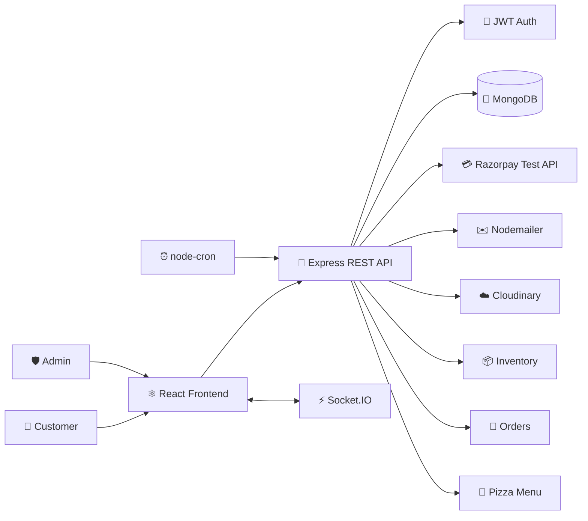

::: {align="center"}
# 🍕 Pizza Delivery --- Full-Stack Ordering & Inventory Platform

```{=html}
<p>
```
``{=html}
``{=html}
``{=html}
``{=html}
``{=html}
``{=html}
``{=html}
```{=html}
</p>
```
```{=html}
<p>
```# 🍕 Pizza Delivery — Full-Stack Ordering & Inventory Platform

<p align="center">
  
</p>

<p align="center">
  <strong>Production-style pizza ordering, customization, payments, real-time tracking, and inventory management.</strong>
</p>

<p align="center">
  
  
  
  
  
  
</p>

---

## 📌 Overview

Pizza Delivery is a full-stack MERN application designed as a production-style pizza ordering and inventory management platform.

The project contains two major experiences:

- **Customer application** — registration, email verification, pizza discovery, custom pizza building, checkout, payment, order history, and real-time order tracking.
- **Admin application** — protected administration, menu management, inventory monitoring, stock updates, order management, and customer management.

The project is built for the **OIBSIP Web Development & Designing Internship — Level 3**.

---

## ✨ Core Features

### 👤 Customer Side

- User registration
- Email verification
- JWT-based authentication
- Login and logout
- Forgot-password flow
- Password reset through email link
- Customer dashboard
- Pizza/menu browsing
- Pizza detail pages
- Custom pizza builder
- Order summary and review
- Razorpay test-mode checkout
- Order confirmation
- Order history
- Individual order details
- Real-time order tracking
- Account management
- Order feedback/reviews

### 🍕 Custom Pizza Builder

The builder follows the required four-step configuration:

| Step | Selection |
|---|---|
| 1 | Pizza Base |
| 2 | Sauce |
| 3 | Cheese |
| 4 | Vegetables — multiple selection |

The selected configuration is displayed before payment so the customer can review the order.

### 📦 Order Lifecycle

```text
Order Received
      ↓
  In Kitchen
      ↓
Sent to Delivery
```

The customer tracking screen receives status updates through Socket.IO.

---

## 🛠️ Admin Side

### 🔐 Admin Authentication

- Separate admin login
- Admin credentials are not created through normal customer registration
- JWT-protected admin routes
- Role-based access protection

### 📊 Inventory Dashboard

The inventory system manages:

- Pizza bases
- Sauces
- Cheese types
- Vegetables

The seeded inventory contains:

- **5 pizza bases**
- **5 sauces**
- **4 cheese types**
- **7 vegetables**

### 📉 Automatic Stock Decrement

After a successful order/payment flow, the selected ingredients are used to calculate inventory consumption.

The application decreases the corresponding ingredient stock according to the customer's pizza configuration.

### ✏️ Manual Stock Updates

Administrators can update inventory quantities from the admin dashboard.

### 🚨 Low-Stock Monitoring

A scheduled background job checks inventory against the configured low-stock threshold.

The threshold is configurable through:

```env
LOW_STOCK_THRESHOLD=20
```

The stock monitor uses `node-cron` and sends an email notification when qualifying inventory items reach the configured threshold.

### 🧾 Order Management

Administrators can:

- View incoming orders
- Open order details
- Update order status
- Move orders through the delivery lifecycle

Customer tracking is updated when the admin changes the order status.

### 🍕 Menu Management

Administrators can:

- Create pizzas
- Edit pizzas
- Upload pizza images
- Set availability
- Mark pizzas as featured
- Soft-delete pizzas

Images are handled through Cloudinary.

---

## 🏗️ Architecture

```text
                         ┌─────────────────────┐
                         │      Customer       │
                         │     React App       │
                         └──────────┬──────────┘
                                    │
                           HTTP / Axios
                                    │
                                    ▼
                         ┌─────────────────────┐
                         │   Express REST API  │
                         │      Node.js        │
                         └──────┬───────┬──────┘
                                │       │
                  ┌─────────────┘       └──────────────┐
                  ▼                                    ▼
          ┌───────────────┐                    ┌───────────────┐
          │    MongoDB    │                    │   Socket.IO   │
          │   Database    │                    │ Real-time API │
          └───────────────┘                    └───────┬───────┘
                                                      │
                                                      ▼
                                             Customer tracking

                  External Services
                  ─────────────────
                  Razorpay → Payments
                  Cloudinary → Images
                  SMTP/Nodemailer → Emails
                  node-cron → Scheduled stock checks
```

---

## 📁 Project Structure

```text
OIBSIP/
│
├── Level 1/
│   ├── Task-1-Landing-Page/
│   ├── Task-2-Portfolio/
│   └── Task-3-Temp-Converter/
│
├── Level 2/
│   └── Calculator/
│
├── Level 3/
│   ├── client/
│   │   ├── public/
│   │   ├── src/
│   │   │   ├── components/
│   │   │   ├── context/
│   │   │   ├── pages/
│   │   │   ├── services/
│   │   │   ├── App.jsx
│   │   │   ├── index.css
│   │   │   └── main.jsx
│   │   ├── index.html
│   │   └── package.json
│   │
│   ├── server/
│   │   ├── config/
│   │   ├── controllers/
│   │   ├── jobs/
│   │   ├── middleware/
│   │   ├── models/
│   │   ├── routes/
│   │   ├── services/
│   │   ├── server.js
│   │   ├── seeder.js
│   │   └── package.json
│   │
│   └── README.md
│
└── .gitignore
```

---

## 💻 Tech Stack

### Frontend

- React 19
- React Router
- Axios
- Socket.IO Client
- Vite
- CSS

### Backend

- Node.js
- Express.js
- MongoDB
- Mongoose
- JWT
- bcryptjs
- Nodemailer
- node-cron
- Socket.IO

### Integrations

- Razorpay — test-mode payments
- Cloudinary — image management
- SMTP — transactional email

---

## 🔐 Authentication Flow

### Registration

```text
Customer
   ↓
Registration Form
   ↓
Backend validation
   ↓
Password hashing
   ↓
Verification token generated
   ↓
Verification email
   ↓
Email verified
   ↓
Account activated
```

### Login

```text
Email + Password
       ↓
Backend authentication
       ↓
JWT generated
       ↓
Token stored by client
       ↓
Protected API access
```

### Forgot Password

```text
Forgot Password
       ↓
Enter email
       ↓
Reset token generated
       ↓
Reset email sent
       ↓
Reset link opened
       ↓
New password
       ↓
Password updated
```

---

## 💳 Payment Flow

The application uses Razorpay in **test mode**.

```text
Customer selects pizza
        ↓
Review order
        ↓
Create Razorpay order
        ↓
Razorpay checkout
        ↓
Test payment
        ↓
Payment verification
        ↓
Order confirmation
        ↓
Inventory processing
        ↓
Order tracking
```

> ⚠️ Never put the Razorpay secret key in the React frontend.

Use environment variables on the server.

---

## 🔄 Real-Time Order Tracking

The project uses Socket.IO for real-time order status updates.

```text
Admin updates order
        ↓
Backend saves new status
        ↓
Socket.IO emits update
        ↓
Order-specific room
        ↓
Customer tracking page
        ↓
UI updates without refresh
```

Order status values:

```text
Order Received
In Kitchen
Sent to Delivery
```

---

## 📦 Inventory Workflow

```text
Customer chooses:
    Base
    Sauce
    Cheese
    Vegetables
          ↓
Order configuration stored
          ↓
Successful payment
          ↓
Inventory quantities updated
          ↓
Low-stock monitor checks stock
          ↓
Email notification if threshold is reached
```

---

## ☁️ Cloudinary Image Management

Pizza menu images can be uploaded from the admin interface.

The backend:

1. Receives the image.
2. Validates the upload.
3. Uploads it to Cloudinary.
4. Stores the image URL.
5. Stores the Cloudinary public ID.
6. Uses the stored URL in the menu.

Supported image formats include:

```text
JPG
PNG
WEBP
```

---

## 📧 Email System

The backend uses Nodemailer for email operations.

Email-related flows include:

- Account verification
- Password reset
- Low-stock notifications

SMTP configuration is kept in server environment variables.

For local development, email failures can be logged instead of exposing secrets.

---

## ⏰ Scheduled Jobs

The stock monitoring job runs using `node-cron`.

Example configuration:

```env
LOW_STOCK_THRESHOLD=20
```

The job periodically checks inventory and can notify the administrator when stock reaches the configured threshold.

---

## 🗄️ Database

MongoDB is used as the application's primary database.

Major data models include:

```text
User
Pizza
Inventory
Order
```

The application also contains supporting data for authentication, order configuration, and administration.

---

## 🌱 Database Seeder

The server includes a seeder for development/setup data.

The seed data includes:

```text
5  Pizza Bases
5  Sauces
4  Cheese Types
7  Vegetables
4  Menu Pizzas
1  Master Admin
```

The seeded admin account is configured by the server environment/seeder configuration.

---

## ⚙️ Environment Variables

Create:

```text
Level 3/server/.env
```

Example:

```env
PORT=5001
CLIENT_URL=http://localhost:5173

MONGO_URI=your_mongodb_connection_string

JWT_SECRET=your_jwt_secret
JWT_EXPIRES_IN=7d

RAZORPAY_KEY_ID=your_razorpay_test_key
RAZORPAY_KEY_SECRET=your_razorpay_test_secret

SMTP_HOST=your_smtp_host
SMTP_PORT=587
SMTP_USER=your_smtp_username
SMTP_PASS=your_smtp_password

ADMIN_EMAIL=admin@pizza.com
ADMIN_PASSWORD=your_admin_password

LOW_STOCK_THRESHOLD=20

CLOUDINARY_CLOUD_NAME=your_cloud_name
CLOUDINARY_API_KEY=your_cloudinary_api_key
CLOUDINARY_API_SECRET=your_cloudinary_api_secret
```

### 🔒 Important

Do **not** commit `.env`.

The repository `.gitignore` should include:

```gitignore
node_modules/
.env
*.env
.DS_Store
dist/
```

---

## 🚀 Installation

### 1. Clone the repository

```bash
git clone https://github.com/Its-AtharvDeshmukh/OIBSIP.git
cd OIBSIP
```

### 2. Open Level 3

```bash
cd "Level 3"
```

### 3. Install frontend dependencies

```bash
cd client
npm install
```

### 4. Install backend dependencies

Open another terminal:

```bash
cd "OIBSIP/Level 3/server"
npm install
```

### 5. Configure environment variables

Create:

```text
Level 3/server/.env
```

and add the required values.

### 6. Seed the database

From the server directory:

```bash
npm run seed
```

If the project uses the seeder directly, use:

```bash
node seeder.js
```

### 7. Start the backend

```bash
npm run dev
```

Backend:

```text
http://localhost:5001
```

### 8. Start the frontend

From the client directory:

```bash
npm run dev
```

Frontend:

```text
http://localhost:5173
```

---

## 🔌 API Overview

### Authentication

```text
POST /api/auth/register
POST /api/auth/login
GET  /api/auth/verify-email/:token
POST /api/auth/forgot-password
POST /api/auth/reset-password/:token
```

### Pizza/Menu

```text
GET /api/pizzas
GET /api/pizzas/:id
```

### Inventory

```text
GET /api/inventory
```

### Orders

```text
GET /api/orders/my-orders
GET /api/orders/:id
```

### Payments

```text
POST /api/payment/create-order
POST /api/payment/verify
```

### Admin

```text
POST /api/admin/login
GET  /api/admin/orders
PATCH /api/admin/orders/:id/status
GET  /api/admin/inventory
```

### Admin Menu

```text
GET    /api/admin/menu
POST   /api/admin/menu
PUT    /api/admin/menu/:id
DELETE /api/admin/menu/:id
```

> API paths should be treated as implementation references and verified against the current server route files before production deployment.

---

## 🧪 Recommended Testing Checklist

Before considering the application production-ready, test the complete flows manually.

### Customer

- [ ] Register a new customer
- [ ] Receive verification email
- [ ] Verify account
- [ ] Login
- [ ] Browse pizzas
- [ ] Open pizza details
- [ ] Build a custom pizza
- [ ] Select base
- [ ] Select sauce
- [ ] Select cheese
- [ ] Select multiple vegetables
- [ ] Review order
- [ ] Open Razorpay test checkout
- [ ] Complete a test payment
- [ ] Confirm order
- [ ] Open order history
- [ ] Track order
- [ ] Receive real-time status update
- [ ] Test forgot password
- [ ] Test password reset

### Admin

- [ ] Login through admin login
- [ ] View dashboard
- [ ] View inventory
- [ ] Update stock
- [ ] Create menu pizza
- [ ] Upload pizza image
- [ ] Edit pizza
- [ ] Change availability
- [ ] Mark featured
- [ ] Soft-delete pizza
- [ ] View incoming orders
- [ ] Update order status
- [ ] Confirm customer receives status update
- [ ] Verify low-stock notification behavior

### Security

- [ ] Confirm `.env` is not committed
- [ ] Confirm Razorpay secret is server-side only
- [ ] Confirm protected admin routes reject unauthorized users
- [ ] Confirm customer routes reject invalid JWTs
- [ ] Confirm passwords are never stored in plain text

---

## 🎨 UI / UX Goals

The application is designed around a modern food-delivery experience.

### Design principles

- Clean visual hierarchy
- Responsive layouts
- Mobile-first interaction
- Clear CTAs
- Consistent cards and forms
- Smooth transitions
- Loading states
- Empty states
- Error states
- Accessible form controls
- Clear order status feedback

### Responsive targets

```text
📱 Mobile
💻 Desktop
🖥️ Large screens
```

---

## 📱 Application Flow

```text
                    CUSTOMER
                       │
              ┌────────▼────────┐
              │   Authentication │
              └────────┬────────┘
                       │
              ┌────────▼────────┐
              │    Dashboard    │
              └────────┬────────┘
                       │
              ┌────────▼────────┐
              │ Browse / Build  │
              │     Pizza       │
              └────────┬────────┘
                       │
              ┌────────▼────────┐
              │  Review Order   │
              └────────┬────────┘
                       │
              ┌────────▼────────┐
              │ Razorpay Test   │
              │    Checkout     │
              └────────┬────────┘
                       │
              ┌────────▼────────┐
              │ Order Confirmed │
              └────────┬────────┘
                       │
              ┌────────▼────────┐
              │ Track Order     │◄──── Socket.IO
              └─────────────────┘


                      ADMIN
                        │
               ┌────────▼────────┐
               │   Admin Login   │
               └────────┬────────┘
                        │
          ┌─────────────┼─────────────┐
          ▼             ▼             ▼
      Inventory       Orders        Menu
          │             │             │
          ▼             ▼             ▼
      Stock Update   Status Update   CRUD
          │             │
          └──────┬──────┘
                 ▼
          Customer Tracking
```

---

## 🔒 Security Considerations

The application uses several security practices:

- JWT authentication
- Password hashing with bcryptjs
- Protected API routes
- Separate admin authentication
- Environment-based secrets
- Server-side Razorpay secret
- Input validation
- Controlled image uploads
- Role-based authorization

For production deployment, additional hardening such as rate limiting, security headers, stronger validation, monitoring, and HTTPS should also be considered.

---

## 📸 Screenshots

Add project screenshots here after final UI testing.

Suggested screenshots:

```text
1. Customer Dashboard
2. Pizza Builder
3. Review Order
4. Razorpay Checkout
5. Order Success
6. Real-Time Order Tracking
7. Admin Dashboard
8. Inventory Management
9. Order Management
10. Menu Management
```

Example:

```md

```

---

## 🎯 Internship Objective

This project demonstrates full-stack development skills through a single integrated application covering:

- React frontend development
- Node.js backend development
- Express REST APIs
- MongoDB database integration
- Authentication and authorization
- Email workflows
- Payment integration
- Real-time communication
- Inventory management
- Scheduled background jobs
- Cloud image storage
- Admin dashboard development
- Responsive UI/UX

---

## 🚧 Future Improvements

Possible future enhancements:

- Online delivery-driver dashboard
- Google Maps delivery tracking
- Coupon and discount system
- Multiple pizza sizes
- Multiple pizza quantities
- Advanced analytics
- Sales reports
- Customer loyalty points
- Push notifications
- PWA support
- Automated deployment pipeline
- Comprehensive automated test suite
- Production monitoring and logging

---

## 👨‍💻 Author

### Atharv Deshmukh

**OIBSIP Web Development & Designing Internship**

GitHub: [Its-AtharvDeshmukh](https://github.com/Its-AtharvDeshmukh)

---

## ⭐ Project

If this project helped you understand full-stack development, consider giving the repository a ⭐ on GitHub.

---

<p align="center">
  <strong>🍕 Build it. Order it. Track it.</strong>
</p>

<p align="center">
  Made with React, Node.js, MongoDB, and lots of pizza 🍕
</p>

``{=html}
```{=html}
</p>
```
```{=html}
<p>
```
`<b>`{=html}🍕 Build it. 🛒 Order it. 💳 Pay it. 📦 Track it. ⚙️ Manage
it.`</b>`{=html}
```{=html}
</p>
```
:::

------------------------------------------------------------------------

## 📖 About the Project

**Pizza Delivery** is a full-stack pizza ordering and inventory
management platform built as a MERN-based internship project.

The application is designed around two distinct experiences:

-   **Customer experience** --- account creation, email verification,
    authentication, pizza discovery, custom pizza building, checkout,
    payment, order history and real-time order tracking.
-   **Administration experience** --- dedicated admin authentication,
    inventory management, order management, student/user management and
    pizza menu management with Cloudinary-powered image handling.

The project connects a React frontend to an Express/Node.js API, uses
MongoDB for persistent data, Razorpay in test mode for checkout,
Socket.IO for real-time order updates, Nodemailer for email workflows
and node-cron for scheduled stock monitoring.

> **Project goal:** demonstrate a complete, connected full-stack
> ordering workflow rather than a static frontend-only pizza website.

------------------------------------------------------------------------

## ✨ Core Features

### 👤 Customer Platform

  -----------------------------------------------------------------------
  Feature                             Description
  ----------------------------------- -----------------------------------
  📝 Registration                     Create a customer account through
                                      the public registration flow

  ✉️ Email Verification               Verification-token based account
                                      verification

  🔐 JWT Authentication               Token-based customer authorization

  🔑 Forgot Password                  Password reset flow using an email
                                      reset link

  🍕 Pizza Dashboard                  Browse available pizzas

  🧑‍🍳 Custom Pizza Builder             Build a pizza from base, sauce,
                                      cheese and vegetables

  🥣 5 Pizza Bases                    Five base inventory options are
                                      seeded

  🍅 5 Sauces                         Five sauce inventory options are
                                      seeded

  🧀 Cheese Selection                 Choose an available cheese type

  🥬 Multiple Vegetables              Select multiple vegetable
                                      ingredients

  🧾 Review Order                     Review pizza configuration,
                                      customer information and total
                                      before payment

  💳 Razorpay Checkout                Razorpay integration configured for
                                      test-mode payments

  ✅ Payment Confirmation             Successful payment verification
                                      confirms the order

  📦 Order History                    View previous orders

  🔎 Order Details                    Inspect an individual order

  🚚 Live Order Tracking              Track order status changes

  ⚡ Real-Time Updates                Socket.IO delivers order status
                                      updates to the customer
  -----------------------------------------------------------------------

### 🛡️ Admin Platform

  -----------------------------------------------------------------------
  Feature                             Description
  ----------------------------------- -----------------------------------
  🔐 Separate Admin Login             Admin authentication is separate
                                      from public customer registration

  📊 Admin Dashboard                  Central operational dashboard

  📦 Inventory Dashboard              View ingredient inventory

  ➕ Manual Stock Updates             Update inventory quantities

  📉 Automatic Stock Deduction        Successful orders consume selected
                                      ingredients

  🚨 Low-Stock Monitoring             Configurable low-stock threshold

  ⏰ Scheduled Monitoring             node-cron checks inventory on a
                                      scheduled basis

  ✉️ Stock Alerts                     Email notification workflow for
                                      low-stock inventory

  🧾 Order Management                 View incoming customer orders

  🔄 Status Management                Update order status from the admin
                                      side

  ⚡ Real-Time Status Sync            Customer tracking receives admin
                                      status changes

  🍕 Menu Management                  Add, update and remove pizza
                                      listings

  ☁️ Cloudinary Media                 Server-side image upload/deletion
                                      workflow

  ⭐ Featured Pizzas                  Pizza listings support featured
                                      status

  🟢 Availability                     Pizza listings support availability
                                      state

  👨‍🎓 Student Management               Admin can create, search and manage
                                      customer/student accounts
  -----------------------------------------------------------------------

------------------------------------------------------------------------

## 🧩 Pizza Builder Flow

The custom pizza builder follows the required ingredient structure:

``` text
                    🍕 CUSTOM PIZZA
                          │
                          ▼
                 ┌──────────────────┐
                 │ 1. Choose Base   │
                 │    5 options     │
                 └────────┬─────────┘
                          │
                          ▼
                 ┌──────────────────┐
                 │ 2. Choose Sauce  │
                 │    5 options     │
                 └────────┬─────────┘
                          │
                          ▼
                 ┌──────────────────┐
                 │ 3. Choose Cheese │
                 └────────┬─────────┘
                          │
                          ▼
                 ┌──────────────────┐
                 │ 4. Vegetables    │
                 │    Multi-select  │
                 └────────┬─────────┘
                          │
                          ▼
                 ┌──────────────────┐
                 │   Order Review   │
                 └────────┬─────────┘
                          │
                          ▼
                 ┌──────────────────┐
                 │ Razorpay Test    │
                 │     Checkout     │
                 └────────┬─────────┘
                          │
                          ▼
                    📦 ORDER CREATED
```

------------------------------------------------------------------------

## 🚚 Order Lifecycle

The application uses the required order-status progression:

``` text
┌────────────────┐
│ Order Received │
└───────┬────────┘
        │
        ▼
┌────────────────┐
│   In Kitchen   │
└───────┬────────┘
        │
        ▼
┌────────────────────┐
│ Sent to Delivery   │
└────────────────────┘
```

When an administrator changes an order status, the backend can emit the
update through **Socket.IO**, allowing the customer tracking interface
to reflect the new state without requiring a full page refresh.

------------------------------------------------------------------------

## 🏗️ System Architecture



------------------------------------------------------------------------

## 🔄 Full Application Workflow

``` text
Customer
   │
   ├── Register
   │      └── Email verification
   │
   ├── Login
   │      └── JWT authorization
   │
   ├── Browse pizzas
   │
   ├── Build custom pizza
   │      ├── Base
   │      ├── Sauce
   │      ├── Cheese
   │      └── Vegetables
   │
   ├── Review order
   │
   ├── Razorpay test checkout
   │
   └── Confirmed order
          │
          ├── Inventory consumption
          ├── Order history
          └── Live tracking
                   ▲
                   │ Socket.IO
                   │
              Admin updates
```

------------------------------------------------------------------------

## 🧱 Technology Stack

### Frontend

-   **React 19**
-   **React DOM**
-   **React Router**
-   **Axios**
-   **Socket.IO Client**
-   **Vite**

### Backend

-   **Node.js**
-   **Express.js**
-   **MongoDB**
-   **Mongoose**
-   **JWT**
-   **bcryptjs**
-   **Socket.IO**
-   **Razorpay**
-   **Nodemailer**
-   **node-cron**
-   **Cloudinary**
-   **Multer**
-   **dotenv**
-   **CORS**

------------------------------------------------------------------------

## 📁 Project Structure

``` text
Level 3/
│
├── client/
│   ├── index.html
│   ├── package.json
│   ├── package-lock.json
│   ├── vite.config.js
│   │
│   └── src/
│       ├── main.jsx
│       ├── App.jsx
│       ├── index.css
│       │
│       ├── components/
│       │   └── Navbar.jsx
│       │
│       ├── context/
│       │   ├── AuthContext.jsx
│       │   └── PizzaBuilderContext.jsx
│       │
│       ├── services/
│       │   └── API service
│       │
│       └── pages/
│           ├── Account.jsx
│           ├── Dashboard.jsx
│           ├── ForgotPassword.jsx
│           ├── Login.jsx
│           ├── Orders.jsx
│           ├── OrderDetail.jsx
│           ├── PizzaBuilder.jsx
│           ├── PizzaDetail.jsx
│           ├── Register.jsx
│           ├── ResetPassword.jsx
│           ├── ReviewOrder.jsx
│           ├── TrackOrder.jsx
│           ├── VerifyEmail.jsx
│           └── admin/
│               ├── AdminDashboard.jsx
│               ├── AdminInventory.jsx
│               ├── AdminLogin.jsx
│               ├── AdminMenuManager.jsx
│               ├── AdminOrders.jsx
│               └── AdminStudents.jsx
│
└── server/
    ├── server.js
    ├── seeder.js
    ├── package.json
    ├── package-lock.json
    │
    ├── config/
    │   ├── db.js
    │   ├── razorpay.js
    │   └── cloudinary.js
    │
    ├── middleware/
    │   └── authMiddleware.js
    │
    ├── models/
    │   ├── Admin.js
    │   ├── InventoryItem.js
    │   ├── Order.js
    │   ├── Pizza.js
    │   └── User.js
    │
    ├── controllers/
    │   ├── adminController.js
    │   ├── adminMenuController.js
    │   ├── adminStudentController.js
    │   ├── authController.js
    │   ├── inventoryController.js
    │   ├── menuController.js
    │   ├── orderController.js
    │   ├── paymentController.js
    │   └── pizzaController.js
    │
    ├── routes/
    │   ├── adminMenuRoutes.js
    │   ├── adminRoutes.js
    │   ├── authRoutes.js
    │   ├── inventoryRoutes.js
    │   ├── orderRoutes.js
    │   ├── paymentRoutes.js
    │   └── pizzaRoutes.js
    │
    ├── services/
    │   └── emailService.js
    │
    └── jobs/
        └── stockMonitor.js
```

------------------------------------------------------------------------

## 🔐 Authentication & Authorization

The project separates customer and administrator access.

### Customer authentication

``` text
Registration
     ↓
Verification token
     ↓
Email verification
     ↓
Login
     ↓
JWT
     ↓
Protected customer APIs
```

### Admin authentication

``` text
Admin credentials
     ↓
Dedicated admin login
     ↓
Admin JWT
     ↓
Protected admin APIs
```

The public customer registration flow does **not** act as an
admin-registration mechanism.

------------------------------------------------------------------------

## 💳 Payment Architecture

Razorpay is integrated on the server side for test-mode checkout.

``` text
Customer
   │
   ▼
Review Order
   │
   ▼
Create Razorpay Order
   │
   ▼
Razorpay Checkout
   │
   ▼
Payment Result
   │
   ▼
Signature Verification
   │
   ▼
Order Confirmation
   │
   ▼
Inventory Processing
```

> **Security:** Razorpay secret credentials belong on the server and
> must never be exposed in the React client.

------------------------------------------------------------------------

## 📦 Inventory Management

Inventory is connected to the pizza ordering workflow.

The seeded inventory is organized around:

``` text
🍞 Pizza Bases
   └── 5 options

🍅 Sauces
   └── 5 options

🧀 Cheeses
   └── Available cheese inventory

🥬 Vegetables
   └── Multiple selectable options
```

After a successful order, the selected ingredients are used by the
inventory workflow.

The admin interface also supports manual inventory updates.

------------------------------------------------------------------------

## 🚨 Automated Low-Stock Monitoring

The backend includes a scheduled stock-monitoring job using
**node-cron**.

``` text
⏰ Scheduled Job
       │
       ▼
Read Inventory
       │
       ▼
Compare With Threshold
       │
       ├── Stock OK ───────► Continue
       │
       └── Low Stock
                │
                ▼
          Email Notification
                │
                ▼
             Admin
```

The threshold is configurable through server environment configuration.

------------------------------------------------------------------------

## ☁️ Cloudinary Image Management

The admin menu workflow includes server-side Cloudinary integration for
pizza images.

``` text
Admin selects image
        │
        ▼
React Admin Menu
        │
        ▼
Express API
        │
        ▼
Multer upload handling
        │
        ▼
Cloudinary
        │
        ▼
Secure image URL
        │
        ▼
MongoDB Pizza document
```

This keeps the media workflow separate from the application database
itself.

------------------------------------------------------------------------

## ⚡ Real-Time Order Tracking

Socket.IO is used for live order-status communication.

``` text
                 Socket.IO
                     │
        ┌────────────┴────────────┐
        │                         │
   Admin Panel               Customer
        │                         │
        │ update status           │
        ▼                         │
    Backend ──────────────────────┘
              emit event
```

The customer tracking page listens for order-specific status updates.

------------------------------------------------------------------------

## 👨‍🎓 Student Management

The project also includes an additional administration feature for
managing customer/student accounts.

Admins can:

-   View students/users
-   Search student records
-   Create a student/customer account
-   Suspend an account
-   Activate an account
-   Trigger the verification workflow for accounts created by admin

Admin-created students are created as customer/user accounts rather than
administrator accounts.

------------------------------------------------------------------------

## 🛡️ Security Considerations

The project uses several common security mechanisms:

-   JWT-based authorization
-   Password hashing with bcryptjs
-   Separate admin authentication
-   Protected admin routes
-   Server-side environment variables
-   Razorpay secret kept on the server
-   Cloudinary secret credentials kept on the server
-   CORS configuration
-   Authentication middleware
-   Email verification
-   Password-reset token workflow

### Never commit secrets

Do **not** commit:

``` text
server/.env
```

Use an example file instead:

``` text
server/.env.example
```

Example:

``` env
PORT=5001
CLIENT_URL=http://localhost:5173

MONGO_URI=your_mongodb_connection_string

JWT_SECRET=your_jwt_secret
JWT_EXPIRES_IN=7d

RAZORPAY_KEY_ID=your_razorpay_test_key
RAZORPAY_KEY_SECRET=your_razorpay_test_secret

EMAIL_HOST=your_smtp_host
EMAIL_PORT=587
EMAIL_USER=your_email
EMAIL_PASS=your_email_password
EMAIL_FROM=your_sender_email

ADMIN_EMAIL=your_admin_email
ADMIN_PASSWORD=your_admin_password

LOW_STOCK_THRESHOLD=20

CLOUD_NAME=your_cloudinary_cloud_name
CLOUD_API_KEY=your_cloudinary_api_key
CLOUD_API_SECRET=your_cloudinary_api_secret
```

------------------------------------------------------------------------

## ⚙️ Installation

### 1. Clone the repository

``` bash
git clone https://github.com/Its-AtharvDeshmukh/OIBSIP.git
cd OIBSIP
```

### 2. Enter Level 3

``` bash
cd "Level 3"
```

### 3. Install frontend dependencies

``` bash
cd client
npm install
```

### 4. Install backend dependencies

``` bash
cd ../server
npm install
```

### 5. Configure environment variables

Create:

``` text
server/.env
```

using the variables shown in the `.env.example` section above.

### 6. Start the backend

From:

``` text
Level 3/server
```

run:

``` bash
npm run dev
```

The backend is configured for:

``` text
http://localhost:5001
```

### 7. Start the frontend

Open a second terminal:

``` bash
cd "Level 3/client"
npm run dev
```

Vite will provide the local frontend URL in the terminal.

------------------------------------------------------------------------

## 🌱 Database Seeding

The backend includes:

``` text
server/seeder.js
```

The seeder is intended to populate the application's initial
inventory/menu/admin data.

Run it according to the project's current server setup and environment
configuration.

> Make sure your MongoDB connection is configured before running
> database seed operations.

------------------------------------------------------------------------

## 🧪 Recommended Testing Flow

Before considering the project final, test the complete workflow rather
than testing only individual pages.

### Customer test

``` text
[ ] Register
[ ] Receive verification email
[ ] Verify account
[ ] Login
[ ] Open dashboard
[ ] Browse pizzas
[ ] Open pizza builder
[ ] Select base
[ ] Select sauce
[ ] Select cheese
[ ] Select multiple vegetables
[ ] Review order
[ ] Open Razorpay test checkout
[ ] Complete test payment
[ ] Verify order
[ ] Confirm inventory changes
[ ] Open order history
[ ] Open order details
[ ] Open live tracking
```

### Admin test

``` text
[ ] Admin login
[ ] Open admin dashboard
[ ] Open inventory
[ ] Manually update inventory
[ ] Open orders
[ ] Change order status
[ ] Confirm customer receives status update
[ ] Open student management
[ ] Create student/customer
[ ] Suspend student
[ ] Activate student
[ ] Open menu manager
[ ] Add pizza
[ ] Upload pizza image
[ ] Edit pizza
[ ] Change availability
[ ] Change featured state
[ ] Remove pizza
[ ] Verify low-stock monitoring
```

------------------------------------------------------------------------

## 📡 Main API Areas

The backend is organized around resource-specific routes.

``` text
/api/auth
    ├── registration
    ├── login
    ├── verification
    ├── forgot password
    └── reset password

/api/pizzas
    ├── list pizzas
    ├── get pizza
    ├── create pizza
    └── delete pizza

/api/orders
    ├── create/read orders
    ├── customer order history
    └── order details

/api/payment
    ├── create Razorpay order
    └── verify payment

/api/admin
    ├── admin authentication
    ├── admin orders
    ├── admin inventory
    └── admin students

/api/admin/menu
    ├── create pizza
    ├── update pizza
    └── delete pizza
```

------------------------------------------------------------------------

## 🎨 UI / UX Direction

The frontend is structured as a modern pizza-ordering application rather
than a basic CRUD interface.

The UI architecture includes:

-   Responsive layouts
-   Reusable React components
-   Customer/admin separation
-   Dashboard-oriented navigation
-   Pizza builder workflow
-   Order review flow
-   Tracking interface
-   Admin operational screens
-   Responsive CSS
-   Error handling through the application UI

The visual system can be extended further with additional
micro-interactions, transitions and motion without changing the backend
architecture.

------------------------------------------------------------------------

## 🗃️ Data Model Overview

``` text
Admin
 │
 └── Admin authentication

User
 │
 ├── Authentication
 ├── Verification
 └── Customer profile

Pizza
 │
 ├── Name
 ├── Description
 ├── Price
 ├── Image
 ├── Availability
 └── Default configuration

InventoryItem
 │
 ├── Category
 ├── Name
 └── Stock

Order
 │
 ├── Customer
 ├── Pizza configuration
 ├── Customer information
 ├── Payment status
 └── Order status
```

------------------------------------------------------------------------

## 📸 Screenshots

Add your final application screenshots here after the UI is verified:

``` text
docs/
├── home.png
├── pizza-builder.png
├── review-order.png
├── payment.png
├── order-tracking.png
├── admin-dashboard.png
├── inventory.png
├── admin-orders.png
└── menu-manager.png
```

Example:

``` md

```

> Recommended: use real screenshots from the final running application
> instead of placeholder images.

------------------------------------------------------------------------

## 🏆 Internship Project Context

This project was developed as part of the **OIBSIP Web Development &
Designing Internship --- Level 3**.

The Level 3 project focuses on implementing a complex full-stack
application using:

``` text
React.js
    +
Node.js
    +
Express.js
    +
MongoDB
    +
API Integration
```

with additional integrations for:

``` text
Razorpay
Cloudinary
Socket.IO
Nodemailer
node-cron
```

------------------------------------------------------------------------

## 🚀 Future Improvements

Possible future production enhancements include:

-   Refresh-token authentication
-   Role/permission matrix
-   Rate limiting
-   Request validation with a dedicated validation library
-   Centralized API error handling
-   Structured logging
-   Payment webhook verification
-   Stronger payment idempotency
-   MongoDB transaction-based inventory processing
-   Pagination for large admin datasets
-   Advanced menu search/filtering
-   Delivery-agent role
-   Coupon/discount engine
-   Multiple pizza quantities in a cart
-   Address book
-   Order cancellation/refund workflows
-   Analytics dashboard
-   Automated deployment pipeline
-   Automated tests
-   CI/CD
-   Production monitoring

------------------------------------------------------------------------

## 📌 Important Development Notes

### Environment

Keep secrets outside source control:

``` text
.env
```

### Dependencies

Do not commit:

``` text
node_modules/
```

### Build output

Do not normally commit:

``` text
dist/
```

### macOS metadata

Do not commit:

``` text
.DS_Store
__MACOSX/
```

------------------------------------------------------------------------

## 🧭 Development Philosophy

This project is built around a simple principle:

> **A full-stack application is not complete when the pages look
> finished. It is complete when the frontend, backend, database,
> authentication, payment, inventory and real-time workflows work
> together correctly.**

The architecture therefore separates responsibilities:

``` text
React
  → User interface & client state

Express / Node.js
  → API & business logic

MongoDB
  → Persistent application data

Razorpay
  → Test payment processing

Cloudinary
  → Pizza image management

Socket.IO
  → Real-time order updates

Nodemailer
  → Email workflows

node-cron
  → Scheduled inventory monitoring
```

------------------------------------------------------------------------

## ⭐ Project Highlights

``` text
🍕 Custom Pizza Builder
🔐 JWT Authentication
✉️ Email Verification
🔑 Password Reset
💳 Razorpay Test Checkout
📦 Inventory Management
🚨 Low-Stock Monitoring
⏰ Scheduled Jobs
⚡ Real-Time Order Tracking
🛡️ Separate Admin System
🍕 Admin Menu Management
☁️ Cloudinary Images
👨‍🎓 Student Management
📊 Admin Dashboard
📱 Responsive Frontend
```

------------------------------------------------------------------------

## 👨‍💻 Author

::: {align="center"}
### Atharv Deshmukh

**Web Development & Designing --- OIBSIP Internship**

Built with React, Node.js, Express, MongoDB and a lot of 🍕

------------------------------------------------------------------------

```{=html}
<p>
```
`<i>`{=html}From selecting the first ingredient to tracking the final
delivery --- the goal is to make the entire pizza journey
connected.`</i>`{=html}
```{=html}
</p>
```
### 🍕 Happy Ordering!
:::
